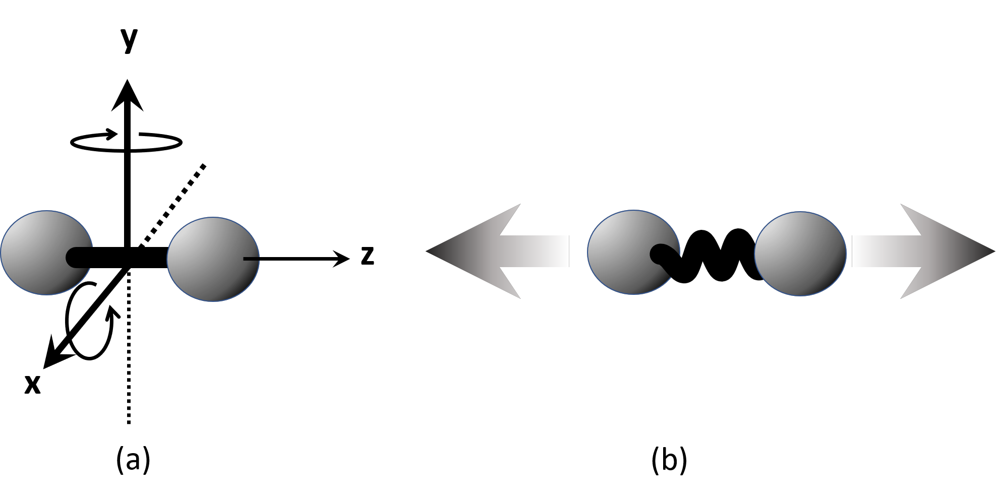
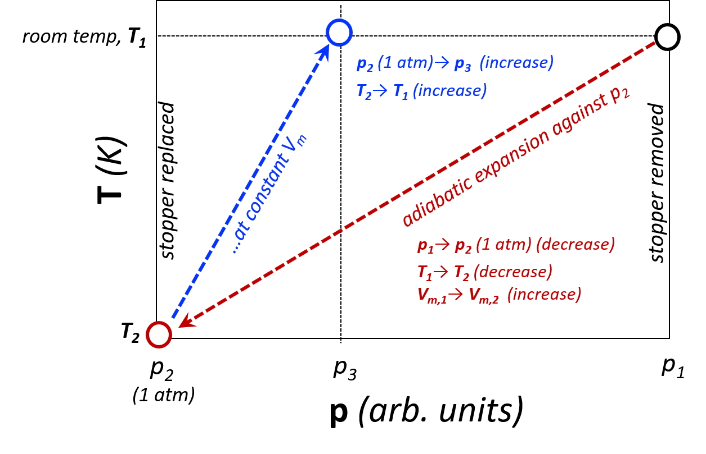

# HEAT CAPACITY RATIO FOR GASES

> [!NOTE]
> Adiabatic Expansion
> 
> Statistical Mechanics
> 
> Data Filtering
> 
> High performance computing

## Thermodynamic Background

According to the classical Equipartition Theorem, energy may be stored in the internal motions of atoms and molecules. The succinct statement of the Equipartition Theorem[^1] was given by Rudolph Clausius in 1857.

The average kinetic energy to be associated with each degree of freedom for a system in thermal equilibrium is $\frac{1}{2} kT$ per molecule.

A degree of freedom ($\nu$), or DOF, is an independent capacity to store energy. A molecule with $N$ atoms has $3N$ total degrees of freedom: each atom may move along the three, independent, x-, y- and z- axes. These $3N$ degrees of freedom may be broken down into the capacity to store energy translation motion ($\frac{1}{2} mv^2$), rotation motion ($\frac{1}{2} I\omega^2$), and vibration motion ($\frac{1}{2} kx^2$), as described below.

A monatomic gas, **He** for example, possesses three (3) translational degrees of freedom: one for each direction of motion (x, y, and z). Any translational motion in three dimensions can be represented as a linear combination of vectors in x, y, and z. Similarly, molecules have three translational degrees of freedom, as shown in Figure [4.1](#Fig4-1-DOF)b below for a homonuclear diatomic molecule. For all atoms and molecules, $\nu_\text{TRAN}$ is 3.

Molecules have additional degrees of freedom for internal motions of rotation and vibration. Of the $3N$ degrees of freedom, 3 are taken up with translational motion of the rigid molecule as described in the previous paragraph and shown in Figure [4.1](#Fig4-1-DOF). For a non-linear molecule, the rigid molecule may rotate about three perpendicular axes, so $\nu_\text{ROT}$ is 3. For diatomic and linear molecules, there is no moment of inertia about the z-axis which by convention is coincident with the chemical bond, thus only 2 rotational degrees of freedom: $\nu_\text{ROT}$ is 2.

$3N-\nu_\text{TRAN}-\nu_\text{ROT}$ degrees of freedom are left over after translations and rotations are considered. That is, $3N-6$ and $3N-5$ degrees of freedom are available for vibrational energy in non-linear and linear molecules, respectively. Molecules have one more caveat to the discussion of vibrational degrees of freedom: energy may be stored as both kinetic and potential energy in the vibrating oscillator. Combined, Equation [4.1](#Eq4-1-U-Equipartition) gives the internal energy, $U$, estimated by the Equipartition Theorem. 

$$
U=\dfrac{1}{2}kT \times(\nu_\text{TRAN}+\nu_\text{ROT}+2\nu_\text{VIB}) 
$$

 

$$
U_m=\dfrac{1}{2}RT \times(\nu_\text{TRAN}+\nu_\text{ROT}+2\nu_\text{VIB}) 
$$

 At room temperature, $U_m$ may be approximated by considering only $\nu_\text{TRAN}$ and $\nu_\text{ROT}$ Although vibrational energy levels are not typically populated at room temperature, comparing measured heat capacities to those predicted by the Equipartition Theorem can give some insight into low frequency vibrational modes contributing to $U_m$.

  | |$\nu_\text{TRAN}$ |  $\nu_\text{ROT}$   |$\nu_\text{VIB}$|
  |-------------------------------| ------------------- |------------------ |------------------|
  |atoms|                                    3  |                0     |             0|
  |diatomic and linear molecules |           3   |               2      |          $3N$-5|
  |Non-linear molecules    |                 3    |              3       |         $3N$-6|
  

A measurable quantity is the molar heat capacity at constant volume, $C_{V,m}$, which is $\bigg(\dfrac{\partial U_m}{\partial T}\bigg)_V$. 

$$
C_{V,m} = \bigg(\dfrac{\partial U_m}{\partial T}\bigg)_V = \dfrac{1}{2}R \times (\nu_\text{TRAN}+\nu_\text{ROT} + 2\nu_\text{VIB})
$$

 We also define the molar heat capacity, $C_{P,m}$ as $\bigg(\dfrac{\partial H_m}{\partial T}\bigg)_P$. For a perfect gas (described by the perfect, or ideal, gas law PV=nRT), 

$$
H_m = U_m + PV_m = U_m + RT
$$

 

$$
C_{P,m} = \bigg(\dfrac{\partial H_m}{\partial T}\bigg)_P = \bigg(\dfrac{\partial U_m}{\partial T}\bigg)_P + R = C_{V,m} + R
$$

 $\bigg(\dfrac{\partial U_m}{\partial T}\bigg)_P$ is equivalent to $\bigg(\dfrac{\partial U_m}{\partial T}\bigg)_V$ for a perfect gas.[^2]

The heat capacity ratio, $C_{P,m}/C_{V,m} = \gamma$ can be determined straightforwardly by monitoring the pressure from an adiabatic expansion, followed by the system coming to equilibrium at constant volume. The technique of determining $\gamma$ from an adiabatic expansion dates to the early 1800s.[4.3](#Fig4-3-pvsT).

**4.3.** Thermodynamic steps for measuring the heat capacity ratio.

Consider a container of gas at room temperature ($T_1$) and a pressure, $p_1$, slightly above atmospheric pressure, $p_2$. If the container is opened briefly, the gas will expand against $p_2$ and continue to expand until the pressure in the container reaches $p_2$ (atmospheric pressure). If the expansion happens adiabatically and reversibly, then 

$$
\begin{align}
dU_m&=-P\ dV_m=-RT\bigg(\dfrac{dV_m}{V_m}\bigg)\\ 
dU_m&=C_{V,m}dT \end{align}
$$

 And combining Equations [4.6](#Eq4-6-dUm) and [4.7](#Eq4-7-dUm) gives 

$$
C_{V,m}\bigg(\dfrac{dT}{T}\bigg)=-R\bigg(\dfrac{dV_m}{V_m}\bigg)
$$

The expansion will cool the gas in the container to $T_2$. Equation [4.8](#Eq4-8-Cvm) can be integrated from $T_1$ to $T_2$ on the left side and $V_{m,1}$ to $V_{m,2}$ on the right side. 

$$
C_{V,m}\int_{T_1}^{T_2}\bigg(\dfrac{dT}{T}\bigg) = -R\int_{V_1}^{V_2}\bigg(\dfrac{dV_m}{V_m}\bigg)
$$

 

$$
C_{V_m} ln\bigg(\dfrac{T_2}{T_1}\bigg) = -R ln \bigg(\dfrac{V_{m,2}}{V_{m,1}}\bigg)
$$

 $T$, $P$, and $V_m$ are related by the ideal gas law, which can be used to manipulate Equation [4.10](#Eq4-10-CvmNatLog) into Equation [4.12](#Eq4-12-CvmNatLog) (the intermediate steps must be shown in the Introduction section of the formal report). 

$$
\dfrac{T_2}{T_1} = \dfrac{p_2V_{m,2}}{p_1V_{m,1}}
$$

 

$$
ln\bigg(\dfrac{p_2}{p_1}\bigg) = -\bigg(\dfrac{C_{p,m}}{C_{V,m}}\bigg) ln\bigg(\dfrac{V_{m,2}}{V_{m,1}}\bigg) = -\gamma ln\bigg(\dfrac{V_{m,2}}{V_{m,1}}\bigg)
$$

 If the container is now closed with the remaining gas at $T_2$, $p_2$, and $V_{m,2}$, the temperature and pressure will begin to rise at constant volume ($V_{m,2}$) until thermal equilibrium is reached at $T_1$ at a pressure $p_4$. Again, invoking the Ideal Gas Law: 

$$
\begin{eqnarray}
RT_1=p_3V_{m,2}=p_1V_{m,1} \\
\dfrac{V_{m,2}}{V_{m,1}} = \dfrac{p_1}{p_3} \end{eqnarray}
$$

 Inserting Equation [4.14](#Eq4-14-CvmNatLog) into [4.12](#Eq4-12-CvmNatLog) gives Equation [4.16](#Eq4-16-Gamma), the final working relationship of the heat capacity ratio to the measured pressures. 

$$
ln(p_2) - ln(p_1) = -\gamma[ln(p_1)-ln(p_3)]
$$

 

$$
\gamma = \dfrac{ln(p_1)-ln(p_2)}{ln(p_1)-ln(p_3)}
$$

 The analysis above makes the implicit assumption that the system is a closed system which, of course, it is not (gas escapes when the stopper is removed). However, a recent excellent paper is still a valid method for determining $\gamma$. Also, treating the expansion as adiabatic is not without question. An alternative approach (discussed by Shoemaker et al[^5] and also Bertrand and McDonald[^6]) treats the expansion as irreversible with 

$$
\gamma = \dfrac{\bigg(\dfrac{p_1}{p_2}-1\bigg)}{\bigg(\dfrac{p_1}{p_3}-1\bigg)}
$$

 In this lab, we will follow the assumption of an adiabatic expansion, but we will compare the results of the Equations [4.16](#Eq4-16-Gamma) and [4.17](#Eq4-17-GammaFrac) in the **Discussion** section of the formal report.

### Discussion Questions

1.  Discuss how your experimental and computational results compare with literature values of $\gamma$. If the results do not agree with established literature values, suggest sources of systematic error that could be the cause. Suggest improvements to the lab to reduce random errors.

2.  Was it safe to ignore the vibrational contributions for ? Did we need the full statistical mechanical explanation to determine heat capacity?

3.  Why is it critical that thermal equilibrium be established at room temperature (STEP 6) before the adiabatic expansion (STEP 7)? Hint: consider question 2 from the pre-lab.

4.  Is your data of sufficient precision to decide whether using the reversible adiabatic expansion method (Equation [4.16](#Eq4-16-Gamma)) is any better or worse that using the irreversible adiabatic expansion method (Equation [4.17](#Eq4-17-GammaFrac)).

5.  Is there a connection between the P-V/P-T diagram you created to describe the thermodynamic cycle and the data you obtained for temperature and pressure? If so, explain this connection.

6.  Since this is a cyclic process, how efficient is this \"engine\"? You can assume various engine types to use relevant equations for efficiency.

7.  Analyze the use of the mathematical approaches to data filtering used.

[^1]: Joseph B. Dence, "Heat Capacity and the Equipartition Theorem," Journal of Chemical Education, 72 no.12 (Dec 1972), 798-804.

[^2]: P W. Atkins, Physical Chemistry, 11th ed. (Oxford, United Kingdom: Oxford University Press, 2018), 62.

[^3]: Clément, N. D.; Desormes, C.-B. Détermination Expérimentale Du Zéro absolu de la chaleur et du calorique spécifique des Gaz. *Journal de Physique, de Chimie, d'Histoire Naturelle et des Arts* **1819**, *8*9, 428–455.

[^4]: Holden, G. L. *J. Chem. Educ.* **2007**, *84* (3), 513.

[^5]: David P. Shoemaker, Carl W. Garland, and Joseph W. Nibler, Experiments in Physical Chemistry, 5th ed. (New York: McGraw-Hill, 1989), 111.

[^6]: Bertrand, G. L.; McDonald, H. O. *J. Chem. Educ.* **1986**, *63* (3), 252.

[^7]: Shoemaker, Garland and Nibler, p.44.
