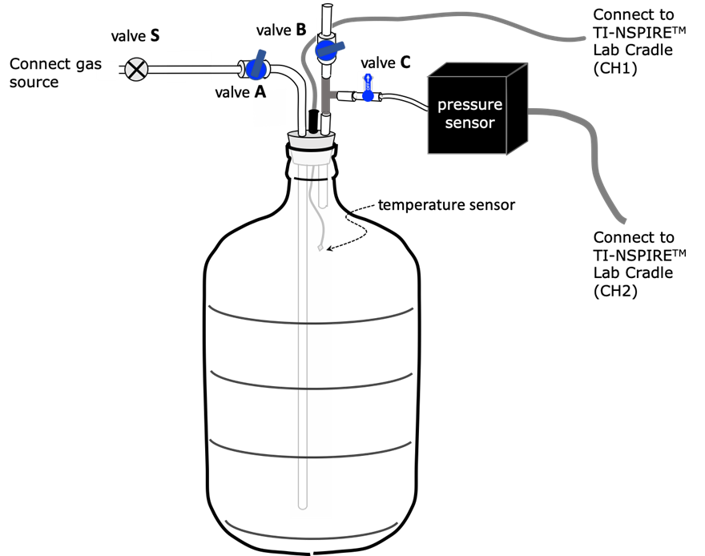
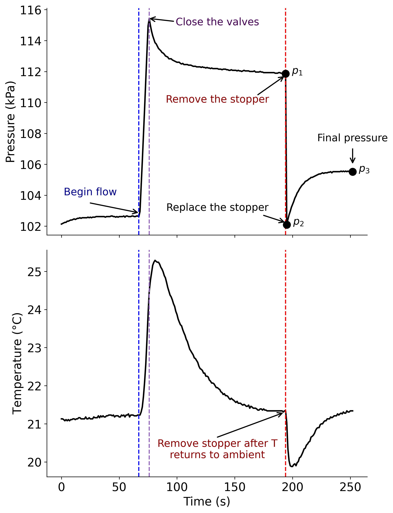

# HEAT CAPACITY RATIO FOR GASES

> [!NOTE]
> Adiabatic Expansion
> 
> Statistical Mechanics
> 
> Data Filtering
> 
> High performance computing

## Thermodynamic Background

According to the classical Equipartition Theorem, energy may be stored in the internal motions of atoms and molecules. The succinct statement of the Equipartition Theorem[^1] was given by Rudolph Clausius in 1857.

The average kinetic energy to be associated with each degree of freedom for a system in thermal equilibrium is $\frac{1}{2} kT$ per molecule.

r\[0pt\]0.4 {width="38%"}

A degree of freedom ($\nu$), or DOF, is an independent capacity to store energy. A molecule with $N$ atoms has $3N$ total degrees of freedom: each atom may move along the three, independent, x-, y- and z- axes. These $3N$ degrees of freedom may be broken down into the capacity to store energy translation motion ($\frac{1}{2} mv^2$), rotation motion ($\frac{1}{2} I\omega^2$), and vibration motion ($\frac{1}{2} kx^2$), as described below.

A monatomic gas, **He** for example, possesses three (3) translational degrees of freedom: one for each direction of motion (x, y, and z). Any translational motion in three dimensions can be represented as a linear combination of vectors in x, y, and z. Similarly, molecules have three translational degrees of freedom, as shown in Figure [4.1](#Fig4-1-DOF)b below for a homonuclear diatomic molecule. For all atoms and molecules, $\nu_\text{TRAN}$ is 3.

l\[0pt\]0.60 {width="38%"}

Molecules have additional degrees of freedom for internal motions of rotation and vibration. Of the $3N$ degrees of freedom, 3 are taken up with translational motion of the rigid molecule as described in the previous paragraph and shown in Figure [4.1](#Fig4-1-DOF). For a non-linear molecule, the rigid molecule may rotate about three perpendicular axes, so $\nu_\text{ROT}$ is 3. For diatomic and linear molecules, there is no moment of inertia about the z-axis which by convention is coincident with the chemical bond, thus only 2 rotational degrees of freedom: $\nu_\text{ROT}$ is 2.

$3N-\nu_\text{TRAN}-\nu_\text{ROT}$ degrees of freedom are left over after translations and rotations are considered. That is, $3N-6$ and $3N-5$ degrees of freedom are available for vibrational energy in non-linear and linear molecules, respectively. Molecules have one more caveat to the discussion of vibrational degrees of freedom: energy may be stored as both kinetic and potential energy in the vibrating oscillator. Combined, Equation [4.1](#Eq4-1-U-Equipartition) gives the internal energy, $U$, estimated by the Equipartition Theorem. 

$$
U=\dfrac{1}{2}kT \times(\nu_\text{TRAN}+\nu_\text{ROT}+2\nu_\text{VIB}) 
$$

 

$$
U_m=\dfrac{1}{2}RT \times(\nu_\text{TRAN}+\nu_\text{ROT}+2\nu_\text{VIB}) 
$$

 At room temperature, U$_m$ may be approximated by considering only $\nu_\text{TRAN}$ and $\nu_\text{ROT}$ Although vibrational energy levels are not typically populated at room temperature, comparing measured heat capacities to those predicted by the Equipartition Theorem can give some insight into low frequency vibrational modes contributing to U$_m$.

$\nu_\text{TRAN}$   $\nu_\text{ROT}$   $\nu_\text{VIB}$
  ------------------------------- ------------------- ------------------ ------------------
  atoms                                    3                  0                  0
  diatomic and linear molecules            3                  2                3$N$-5
  Non-linear molecules                     3                  3                3$N$-6

  : Degrees of Freedom

A measurable quantity is the molar heat capacity at constant volume, $C_{V,m}$, which is $\bigg(\dfrac{\partial U_m}{\partial T}\bigg)_V$. 

$$
C_{V,m} = \bigg(\dfrac{\partial U_m}{\partial T}\bigg)_V = \dfrac{1}{2}R \times (\nu_\text{TRAN}+\nu_\text{ROT} + 2\nu_\text{VIB})
$$

 We also define the molar heat capacity, $C_{P,m}$ as $\bigg(\dfrac{\partial H_m}{\partial T}\bigg)_P$. For a perfect gas (described by the perfect, or ideal, gas law PV=nRT), 

$$
H_m = U_m + PV_m = U_m + RT
$$

 

$$
C_{P,m} = \bigg(\dfrac{\partial H_m}{\partial T}\bigg)_P = \bigg(\dfrac{\partial U_m}{\partial T}\bigg)_P + R = C_{V,m} + R
$$

 $\bigg(\dfrac{\partial U_m}{\partial T}\bigg)_P$ is equivalent to $\bigg(\dfrac{\partial U_m}{\partial T}\bigg)_V$ for a perfect gas.[^2]

The heat capacity ratio, $C_{P,m}/C_{V,m} = \gamma$ can be determined straightforwardly by monitoring the pressure from an adiabatic expansion, followed by the system coming to equilibrium at constant volume. The technique of determining $\gamma$ from an adiabatic expansion dates to the early 1800s.[4.3](#Fig4-3-pvsT).

**4.3.** Thermodynamic steps for measuring the heat capacity ratio.

Consider a container of gas at room temperature (T$_1$) and a pressure, p$_1$, slightly above atmospheric pressure, p$_2$. If the container is opened briefly, the gas will expand against p$_2$ and continue to expand until the pressure in the container reaches p$_2$ (atmospheric pressure). If the expansion happens adiabatically and reversibly, then 

$$
\begin{align}
dU_m&=-P\ dV_m=-RT\bigg(\dfrac{dV_m}{V_m}\bigg)\\ 
dU_m&=C_{V,m}dT \end{align}
$$

 And combining Equations [4.6](#Eq4-6-dUm) and [4.7](#Eq4-7-dUm) gives 

$$
C_{V,m}\bigg(\dfrac{dT}{T}\bigg)=-R\bigg(\dfrac{dV_m}{V_m}\bigg)
$$

The expansion will cool the gas in the container to $T_2$. Equation [4.8](#Eq4-8-Cvm) can be integrated from $T_1$ to $T_2$ on the left side and $V_{m,1}$ to $V_{m,2}$ on the right side. 

$$
C_{V,m}\int_{T_1}^{T_2}\bigg(\dfrac{dT}{T}\bigg) = -R\int_{V_1}^{V_2}\bigg(\dfrac{dV_m}{V_m}\bigg)
$$

 

$$
C_{V_m} ln\bigg(\dfrac{T_2}{T_1}\bigg) = -R ln \bigg(\dfrac{V_{m,2}}{V_{m,1}}\bigg)
$$

 $T$, $P$, and $V_m$ are related by the ideal gas law, which can be used to manipulate Equation [4.10](#Eq4-10-CvmNatLog) into Equation [4.12](#Eq4-12-CvmNatLog) (the intermediate steps must be shown in the Introduction section of the formal report). 

$$
\dfrac{T_2}{T_1} = \dfrac{p_2V_{m,2}}{p_1V_{m,1}}
$$

 

$$
ln\bigg(\dfrac{p_2}{p_1}\bigg) = -\bigg(\dfrac{C_{p,m}}{C_{V,m}}\bigg) ln\bigg(\dfrac{V_{m,2}}{V_{m,1}}\bigg) = -\gamma ln\bigg(\dfrac{V_{m,2}}{V_{m,1}}\bigg)
$$

 If the container is now closed with the remaining gas at $T_2$, $p_2$, and $V_{m,2}$, the temperature and pressure will begin to rise at constant volume ($V_{m,2}$) until thermal equilibrium is reached at $T_1$ at a pressure $p_4$. Again, invoking the Ideal Gas Law: 

$$
\begin{eqnarray}
RT_1=p_3V_{m,2}=p_1V_{m,1} \\
\dfrac{V_{m,2}}{V_{m,1}} = \dfrac{p_1}{p_3} \end{eqnarray}
$$

 Inserting Equation [4.14](#Eq4-14-CvmNatLog) into [4.12](#Eq4-12-CvmNatLog) gives Equation [4.16](#Eq4-16-Gamma), the final working relationship of the heat capacity ratio to the measured pressures. 

$$
ln(p_2) - ln(p_1) = -\gamma[ln(p_1)-ln(p_3)]
$$

 

$$
\gamma = \dfrac{ln(p_1)-ln(p_2)}{ln(p_1)-ln(p_3)}
$$

 The analysis above makes the implicit assumption that the system is a closed system which, of course, it is not (gas escapes when the stopper is removed). However, a recent excellent paper[4.16](#Eq4-16-Gamma) is still a valid method for determining $\gamma$. Also, treating the expansion as adiabatic is not without question. An alternative approach (discussed by Shoemaker et al[^5] and also Bertrand and McDonald[^6]) treats the expansion as irreversible with 

$$
\gamma = \dfrac{\bigg(\dfrac{p_1}{p_2}-1\bigg)}{\bigg(\dfrac{p_1}{p_3}-1\bigg)}
$$

 In this lab, we will follow the assumption of an adiabatic expansion, but we will compare the results of the Equations [4.16](#Eq4-16-Gamma) and [4.17](#Eq4-17-GammaFrac) in the **Discussion** section of the formal report.

## Procedure

The experimental set-up is given in Figure [4.4](#Fig4-4-carboy). It consists of a 5-gallon glass carboy fitted with a #7 stopper with three holes. As shown in the figure, the three-hole stopper allows for a gas inlet, gas outlet and pressure sensor, and a port for a temperature sensor. The configuration in Figure [4.4](#Fig4-4-carboy) indicates that the carboy will be filled by gas heavier than the gas currently in the carboy. Heavy gas enters at the bottom of the carboy and pushes the lighter gas out. In the case where a lighter gas is introduced, then the gas source will be attached to the valve B side and the valve A side will be the outlet.

Pressure will be monitored with a Vernier Biological Gas Pressure Sensor (BGP-DIN). Temperature will be monitored with a Vernier Surface Temperature Sensor (STS-BTA). Both sensors are designed to be integrated with the TI Lab Cradle and handheld unit and computer-based software (see Appendix [A](#AppA-TI)). The BGP-DIN pressure sensor is calibrated over the range 0.75 to 1.54 atm. In STEP 1 below you will determine $\Delta_{95}p$. The STS-BTA temperature sensor has $\Delta_{95}T$ of 0.1$\degree$C.

**4.4.** Experimental set-up for the measurement of the heat capacity ratio

#### STEP 1. Determine $p_2$ and $\Delta_{95}p_2$

1.  Referring to Figure [4.4](#Fig4-4-carboy), the valve orientation should follow the table below:

    Valve S (to gas source)   CLOSED
      ------------------------- --------
      Valve A                   OPEN
      Valve B                   OPEN
      Valve C                   OPEN

2.  Set up data collection in the as follows

    - Pressure units: kPa Decimal points: 3

    - Duration: 100s

    - Rate: *Interval mode*, 1 sample/s

3.  Start data collection to collect 101 data points. There are two pressure sensors that will count as two runs.

4.  Transfer the data into Excel and determine mean and $\Delta_{95}$ for $p_2$ (atmospheric pressure) and $\Delta_{95}$ for room temperature. Use the techniques learned in **Lab [1](#Lab1-ExpData)**.

#### STEP 2. Fill the carboy

In this step, the carboy will be flushed with the gas under investigation and finally filled to 5 to 8 kPa above atmospheric pressure

1.  Referring to Figure [4.4](#Fig4-4-carboy), the valve orientation should follow the table below:

    Valve S (to gas source)   OPEN
      ------------------------- ------
      Valve A                   OPEN
      Valve B                   OPEN
      Valve C                   OPEN

2.  Adjust valve S so that a small flow of gas is running through the carboy for roughly 15 minutes.

The 15-minute flushing is only required only at the beginning of the experiment and when gas sources are changed. Between runs, flushing for just a few minutes is sufficient.

#### STEP 3. Set pressure to atmospheric again

After flushing, close Valves S, A and B (**in that order**) to stop the flow into the carboy.

Valve S (to gas source)   CLOSED
  ------------------------- --------
  Valve A                   CLOSED
  Valve B                   CLOSED
  Valve C                   OPEN

#### STEP 4. Start data collection

1.  Set up data collection in the as follows

    - Pressure units: kPa Decimal points: 3

    - Duration: 450s

    - Rate: *Interval mode*, 2 sample/s

2.  Start data collection and continue for 1-2 minutes, then move onto STEP 5.

#### STEP 5. Charge the carboy to $\approx$110 kPa

1.  OPEN **Valve A** and slowly open **Valve S** slightly to begin flowing gas again through the carboy.

    Valve S (to gas source)   SLIGHTLY OPEN
      ------------------------- ---------------
      Valve A                   OPEN
      Valve B                   CLOSED
      Valve C                   OPEN

2.  When the pressure reaches $\approx$ 110 kPa, close **Valve S**. The valve configuration should now be:

    Valve S (to gas source)   CLOSED
      ------------------------- --------
      Valve A                   OPEN
      Valve B                   CLOSED
      Valve C                   OPEN

#### STEP 6. Allow for thermal equilibrium to be re-established.

The temperature will increase as the carboy is filled (see Figure [4.5](#Fig4-5-TempPressProfile)). After stopping the flow in **STEP 5**, the temperature will begin to come back to room temperature. Thermal equilibrium should take $\approx$ 2-3 minutes. Once the temperature is back to the initial temperature (or within 0.1 $\degree$C), then do the next step.

#### STEP 7. Adiabatic expansion and constant volume heating.

1.  Remove the stopper entirely then immediately reset the in the carboy. The temperature and pressure will immediately drop.

2.  When the pressure is reset, the temperature will begin returning to ambient and the pressure will rise above atmospheric pressure as the gas in the carboy heats at a constant volume.

3.  Stop data collection $\approx$ 3 minutes after the stopper has been reset.

4.  The total run time should take anywhere from 250 s ($\approx$ 4 minutes) to 350 s ($\approx$ 6 minutes). The limit of 450 s is there for extra time if needed.

#### STEP 8. REPEAT STEPS 2-7 for each gas

Repeat **STEP 2** to **STEP 7** for each gas provided at the time of the laboratory. The gases planned for this experiment are Ar, (or compressed air), and . For each successive experiment with the same gas, an abbreviated purging time is acceptable.

> [!IMPORTANT]
> For safety, all runs MUST be either be done in a fume hood or outside to ensure proper ventilation of (g). No smoking/vaping is allowed near the tank.

### STEP 9. Complete the Jupyter Notebook (second week)

After data collection is completed, Python data analysis will happen the following week. The Jupyter Notebook for the requisite data analysis is uploaded to Brightspace.

1.  Use the same techniques and Python packages from Labs [1](#Lab1-ExpData) and [2](#Lab2-HeatNeut) to visualize P vs. t for each gas.

2.  Filter the data using data slices to calculate $p_1$, $p_2$, and $p_3$ as follows for each run:

    - Report $p_1$ as the average of the last 10 pressure reading before the stopper is removed.

    - Report $p_2$ as the lowest pressure reading immediately after the stopper is replaced.

    - Report $p_3$ as the average of the last 10 pressure readings before stopping the data collection.

3.  Use PSI4 (a computational chemistry program) to compute the heat capacities for Ar, , and using statistical thermodynamics. Extract the relevant information from the text-based output files.

**4.5.** Pressure (top) and Temperature (bottom) profile for the procedure.

## Required Elements for the Lab Report

The formal lab report must be written using the template provided. Do not change any of the document attributes (fonts, margins, line spacings, etc.). Please refer to the grading rubrics on page to make sure all required elements are in the formal report. **USE CORRECT SIGNIFICANT FIGURES AND PROPAGATION OF ERRORS LEARNED FROM LAB [1](#Lab1-ExpData)**.

### Tables and Calculations

1.  In the **Results and Discussion** section, report your determination of $\Delta_{95}p$ using the same methods as used in LAB [1](#Lab1-ExpData). TREATMENT OF EXPERIMENTAL DATA.

2.  In the **Results and Discussion** section, include one table with the experimental conditions for all runs per gas. Two runs per gas with two sensors per run gives a total of four pressure measurements.

    +-------+-------+------------------------------+------------------------------+------------------------------+
    |       |       |                              |                              |                              |
    +:=====:+:=====:+:============================:+:============================:+:============================:+
    |       |       | $p \pm \Delta_{95}p$ (kPa) | $p \pm \Delta_{95}p$ (kPa) | $p \pm \Delta_{95}p$ (kPa) |
    +-------+-------+------------------------------+------------------------------+------------------------------+
    | RUN 1 | $p_1$ |                              |                              |                              |
    |       +-------+------------------------------+------------------------------+------------------------------+
    |       | $p_2$ |                              |                              |                              |
    |       +-------+------------------------------+------------------------------+------------------------------+
    |       | $p_3$ |                              |                              |                              |
    +-------+-------+------------------------------+------------------------------+------------------------------+
    | RUN 2 | $p_1$ |                              |                              |                              |
    |       +-------+------------------------------+------------------------------+------------------------------+
    |       | $p_2$ |                              |                              |                              |
    |       +-------+------------------------------+------------------------------+------------------------------+
    |       | $p_3$ |                              |                              |                              |
    +-------+-------+------------------------------+------------------------------+------------------------------+
    | RUN 3 | $p_1$ |                              |                              |                              |
    |       +-------+------------------------------+------------------------------+------------------------------+
    |       | $p_2$ |                              |                              |                              |
    |       +-------+------------------------------+------------------------------+------------------------------+
    |       | $p_3$ |                              |                              |                              |
    +-------+-------+------------------------------+------------------------------+------------------------------+
    | RUN 4 | $p_1$ |                              |                              |                              |
    |       +-------+------------------------------+------------------------------+------------------------------+
    |       | $p_2$ |                              |                              |                              |
    |       +-------+------------------------------+------------------------------+------------------------------+
    |       | $p_3$ |                              |                              |                              |
    +-------+-------+------------------------------+------------------------------+------------------------------+

    Since $p_1$ and $p_3$ will be mean, or average values from ten (10) measurements, the uncertainty in the mean must be considered when reporting the $\Delta_{95}p$ in the table above.[^7] 

$$
\sigma_\text{MEAN} = \dfrac{\sigma}{\sqrt{N}} = \dfrac{\sigma}{\sqrt{10}} \approxeq \dfrac{\sigma}{3.16}
$$

 $\sigma$ in this case is the standard deviation that was calculated in **STEP 1** to determine $\Delta_{95}p$ 

$$
\Delta_{95,\text{MEAN}} = t_{95, N=9} \times \sigma_\text{MEAN} = 2.26 \times \sigma_\text{MEAN} = \dfrac{2.26 \times \sigma}{3.16} = 0.715 \times \sigma
$$

 Since $p_2$ is a single measurement, $\Delta_{95}p$ is the same as what was determined in **STEP 1**

3.  In either the **Results and Discussion** or **Appendix** section, there should be a table of results of $\gamma$ for each of the gases examined. Propagate the errors in $p_1$, $p_2$, and $p_3$ through Equation [4.14](#Eq4-14-CvmNatLog) to get an overall $\Delta_{95}\gamma$ for each of the runs. Using Equations [4.16](#Eq4-16-Gamma) and [4.17](#Eq4-17-GammaFrac), determine the $\Delta_{95}\gamma_\text{MEAN}$ (N=4, so you will need to use $t_\text{95,N=3}$ in Equation [4.17](#Eq4-17-GammaFrac)).

### Figures

For all figures in the formal report, use the guidelines in the formal report template.

1.  Include a representative plot of temperature vs. time and pressure vs. time for each gas studied (**Results and Discussion**).

2.  Include all data as plots in the **Appendix** section.

3.  Like the thermodynamic cycles covered in lecture, starting from atmospheric pressure and room temperature, the steps consisted of an isochoric heating when adding the gas, an isochoric cooling back to the initial temperature (room temperature), an adiabatic expansion, an isochoric heating back to the initial temperature, and then an isothermal expansion back to atmospheric pressure (venting valve B). Create a representative plot of the pressures on a P-V or P-T diagram. **Results and Discussion** or **Appendix**

4.  On the Brightspace page for this lab, there is a PowerPoint file with the graphs used in the handout. If you think they will be useful in your lab write-up to help illustrate a point, please use them and cite the lab manual.

### Discussion Questions

1.  Discuss how your experimental and computational results compare with literature values of $\gamma$. If the results do not agree with established literature values, suggest sources of systematic error that could be the cause. Suggest improvements to the lab to reduce random errors.

2.  Was it safe to ignore the vibrational contributions for ? Did we need the full statistical mechanical explanation to determine heat capacity?

3.  Why is it critical that thermal equilibrium be established at room temperature (STEP 6) before the adiabatic expansion (STEP 7)? Hint: consider question 2 from the pre-lab.

4.  Is your data of sufficient precision to decide whether using the reversible adiabatic expansion method (Equation [4.16](#Eq4-16-Gamma)) is any better or worse that using the irreversible adiabatic expansion method (Equation [4.17](#Eq4-17-GammaFrac)).

5.  Is there a connection between the P-V/P-T diagram you created to describe the thermodynamic cycle and the data you obtained for temperature and pressure? If so, explain this connection.

6.  Since this is a cyclic process, how efficient is this \"engine\"? You can assume various engine types to use relevant equations for efficiency.

7.  Analyze the use of the mathematical approaches to data filtering used.

## Pre-Lab Assignments/Quizzes (5 pts each)

**COMPLETE ALL PRE-LAB ASSIGNMENTS/ QUIZZES BEFORE COMING TO LAB**\

### Experimental Pre-lab Quiz (5 pts)

Show all your work in your lab notebook clearly marked as "PRELAB WORK"\

1.  Read the procedure carefully. One of the most critical steps is to let the gas in the carboy come to thermal equilibrium (**STEP 6**) before the stopper is removed to initiate the adiabatic expansion (**STEP 7**).

2.  Derive Equation [4.10](#Eq4-10-CvmNatLog) (you'll need this for the formal report)

3.  Complete the following table and place into your notebook. Correct citations are required for literature values. Use Equation [4.3](#Eq4-3-Cvm) and [4.5](#Eq4-5-Cpm) for the Equipartition columns.

\|x1cm\|x2cm\|Y\|x2cm\|Y\|x2cm\|Y\| & & &\
& Lit & Equipartition & Lit & Equipartition & Lit & Equipartition\
Ar &&&&&&\
&&&&&&\
&&&&&&\

### Python Analysis Pre-Lab Assignment (5 pts)

You will need to download the Rotation 3 pre-lab Jupyter Notebook from Brightspace. Then upload the .ipynb file to your Google Drive and open it in Google Colab. Once the assignment is completed, you will submit a shareable link to Brightspace as your assignment submission. This pre-lab assignment focuses on techniques you will use for data analysis related to Labs [4](#Lab4-Adiabatic) and [7](#Lab7-FPD).

## Lab Notebook Grading Rubric (10 pts)

1.  (**2 pts**) Laboratory notebook set-up

    1.  Notebook labeling

    2.  Table of contents

    3.  Page numbering

    4.  Use of ink

2.  (**8 pts**) Laboratory work

    1.  Neat and organized.

    2.  All data collected in the lab contained in the notebook.

    3.  Each page signed and dated.

    4.  Make sure that you reference your Excel data. This would just be the name of the file since folder structures can change. You do not need to provide your full file path.

## Formal Report Grading Rubric

Submission Instructions: Submit to **Brightspace**

m8cm\|X\|x1cm\|x2cm\| & Formal report \* 0.65 & 65 &\
& Lab notebook & 10 &\
& Assignments/ Quizzes & 25 &\
& Total & 100 &\

\|x3cm\|X\|x1.1cm\|x1.1cm\| Section & Key Points & Points & Grade\
ALL & Formatting & 10 &\
ALL & Spelling and Grammar & 5 &\
Abstract & Clarity and Completeness & 5 &\
& • Purpose, Principles& \*10 &\
&• Methods, References&&\
& • Equipment and procedure (specific sensors and software) & \*15 &\
&• Flow (step-by-step). Python code setup.&&\
&• Include materials here: identity and purity of gases&&\
& • Calculation and data for $\Delta_{95}p$ determination& \*15 &\
&• Table of measurements ($p_1$, $p_2$, $p_3$ per instructions)&&\
&• Uncertainties in $p_1$, $p_2$, $p_3$&&\
&• units and sig figs&&\
&• Table clarity and title&&\
&• Raw data graph (temp vs. time and pressure vs. time)&&\
&• comment on trends in the data and differences seen between the three gases.&&\
& • What is the end goal? & \*15 &\
&• Table of $\gamma$ determinations with uncertainty&&\
&• Error in $\gamma$ and $\gamma_\text{MEAN}$&&\
&• Analysis of the largest components of error and code&&\
&• Correct propagation of errors&&\
& • Address the discussion questions on page & 20 &\
Conclusion & Summary, next steps, suggestions & 5 &\
**Total** & & **100** &\

[^1]: Joseph B. Dence, "Heat Capacity and the Equipartition Theorem," Journal of Chemical Education, 72 no.12 (Dec 1972), 798-804.

[^2]: P W. Atkins, Physical Chemistry, 11th ed. (Oxford, United Kingdom: Oxford University Press, 2018), 62.

[^3]: Clément, N. D.; Desormes, C.-B. Détermination Expérimentale Du Zéro absolu de la chaleur et du calorique spécifique des Gaz. *Journal de Physique, de Chimie, d'Histoire Naturelle et des Arts* **1819**, *8*9, 428–455.

[^4]: Holden, G. L. *J. Chem. Educ.* **2007**, *84* (3), 513.

[^5]: David P. Shoemaker, Carl W. Garland, and Joseph W. Nibler, Experiments in Physical Chemistry, 5th ed. (New York: McGraw-Hill, 1989), 111.

[^6]: Bertrand, G. L.; McDonald, H. O. *J. Chem. Educ.* **1986**, *63* (3), 252.

[^7]: Shoemaker, Garland and Nibler, p.44.
